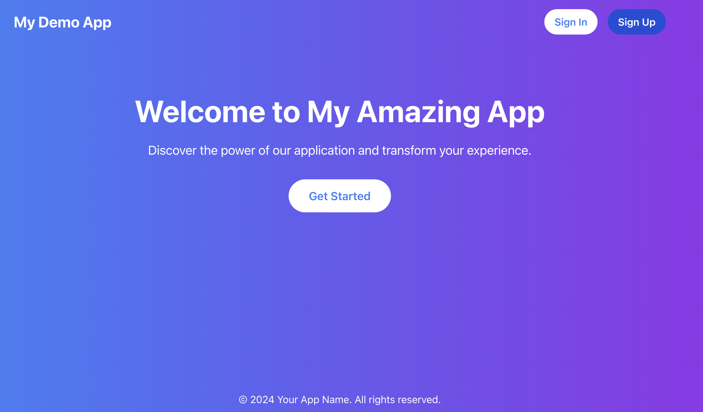

# React Authentication App with AWS Cognito and API Integration



## Table of Contents
- [React Authentication App with AWS Cognito and API Integration](#react-authentication-app-with-aws-cognito-and-api-integration)
  - [Table of Contents](#table-of-contents)
  - [Project Overview](#project-overview)
  - [Purpose](#purpose)
  - [Technologies Used](#technologies-used)
  - [Authentication Flow](#authentication-flow)
  - [Prerequisites](#prerequisites)
  - [Installation](#installation)
  - [AWS Setup](#aws-setup)
    - [Cognito Setup](#cognito-setup)
    - [Lambda Function Setup](#lambda-function-setup)
    - [API Gateway Setup](#api-gateway-setup)
  - [Configuration](#configuration)
  - [Running the App](#running-the-app)
  - [Project Structure](#project-structure)
  - [Key Components](#key-components)
  - [Code Explanation](#code-explanation)
    - [App.js](#appjs)
    - [Authentication Components](#authentication-components)
      - [SignUp.js](#signupjs)
      - [Login.js](#loginjs)
    - [Protected Components](#protected-components)
      - [Home.js and Profile.js](#homejs-and-profilejs)
      - [UserAnalytics.js](#useranalyticsjs)
    - [AWS Amplify Integration](#aws-amplify-integration)
  - [API Integration](#api-integration)
  - [Styling](#styling)
  - [Deployment Considerations](#deployment-considerations)
  - [Additional Notes](#additional-notes)
  - [Troubleshooting](#troubleshooting)
  - [About me](#about-me)

## Project Overview

This project is a React-based web application that demonstrates user authentication using AWS Cognito. It includes features such as user registration, login, profile management, and access to protected routes. The application also integrates with a custom API built with AWS Lambda and API Gateway to fetch and display user analytics data.

## Purpose

The main purposes of this application are:
1. To showcase a robust authentication system using AWS Cognito in a React application.
2. To demonstrate the integration of a React frontend with AWS services (Cognito, Lambda, API Gateway).
3. To provide a template for developers looking to implement similar authentication flows in their projects.
4. To display how to create and consume protected API endpoints.

## Technologies Used

- Frontend:
  - React.js
  - React Router for navigation
  - AWS Amplify for AWS service integration
  - Recharts for data visualization
  - Tailwind CSS for styling

- Backend:
  - AWS Cognito for user authentication
  - AWS Lambda for serverless backend logic
  - AWS API Gateway for API management
  - Python for Lambda function

## Authentication Flow

1. User signs up with email, username, and password
2. User confirms signup with a verification code sent to their email
3. User logs in with username and password
4. Upon successful authentication, user is granted access to protected routes
5. User can view their profile, access analytics, and log out

## Prerequisites

Before you begin, ensure you have the following installed:
- Node.js (v14 or later)
- npm (v6 or later)
- AWS CLI
- An AWS account with appropriate permissions

## Installation

1. Clone the repository:
   ```
   git clone https://github.com/labeveryday-cloud-projects/react-cognito-analytics-dashboard.git
   cd react-cognito-analytics-dashboard
   ```

2. Install dependencies:
   ```
   npm install
   ```

## AWS Setup

### Cognito Setup

1. Go to the AWS Cognito Console
2. Create a new User Pool
3. Configure sign-in options (email, username)
4. Set password strength requirements
5. Configure MFA settings (optional)
6. Add an app client (with no secret)
7. Note down the User Pool ID and App Client ID

### Lambda Function Setup

1. Go to the AWS Lambda Console
2. Create a new function
3. Choose Python 3.x as the runtime
4. Use the following code for your Lambda function:

   ```python
   import json
   import random
   from datetime import datetime, timedelta

   def lambda_handler(event, context):
       # Generate mock user analytics data
       user_data = generate_user_analytics()
       
       return {
           'statusCode': 200,
           'body': json.dumps(user_data),
           'headers': {
               'Content-Type': 'application/json',
               'Access-Control-Allow-Origin': '*',
               'Access-Control-Allow-Headers': 'Content-Type,X-Amz-Date,Authorization,X-Api-Key,X-Amz-Security-Token',
               'Access-Control-Allow-Methods': 'GET,OPTIONS'
           }
       }

   def generate_user_analytics():
       end_date = datetime.now()
       start_date = end_date - timedelta(days=7)
       
       data = []
       current_date = start_date
       
       while current_date <= end_date:
           data.append({
               'date': current_date.strftime('%Y-%m-%d'),
               'activeUsers': random.randint(1000, 5000),
               'newSignups': random.randint(50, 300),
               'pageViews': random.randint(10000, 50000),
               'avgSessionDuration': round(random.uniform(120, 600), 2)  # in seconds
           })
           current_date += timedelta(days=1)
       
       return {
           'userAnalytics': data,
           'totalActiveUsers': sum(day['activeUsers'] for day in data),
           'totalNewSignups': sum(day['newSignups'] for day in data),
           'totalPageViews': sum(day['pageViews'] for day in data),
           'avgSessionDuration': round(sum(day['avgSessionDuration'] for day in data) / len(data), 2)
       }
   ```

5. Deploy the Lambda function

### API Gateway Setup

1. Go to the API Gateway Console
2. Create a new REST API
3. Create a new resource (e.g., /data)
4. Create a GET method for this resource
5. Integrate the GET method with your Lambda function
6. Enable CORS for the resource:
   - Access-Control-Allow-Origin: '*'
   - Access-Control-Allow-Headers: 'Content-Type,X-Amz-Date,Authorization,X-Api-Key,X-Amz-Security-Token'
   - Access-Control-Allow-Methods: 'GET,OPTIONS'
7. Create a Cognito User Pool Authorizer
8. Apply the authorizer to your GET method
9. Deploy the API and note down the invoke URL

## Configuration

1. Create a file named `aws-exports.js` in the `src` directory with the following content:

   ```javascript
   const awsmobile = {
     "aws_project_region": "YOUR_REGION",
     "aws_cognito_region": "YOUR_REGION",
     "aws_user_pools_id": "YOUR_USER_POOL_ID",
     "aws_user_pools_web_client_id": "YOUR_APP_CLIENT_ID",
     "aws_cloud_logic_custom": [
       {
         "name": "MY-API-GATEWAY-NAME",
         "endpoint": "YOUR_API_GATEWAY_ENDPOINT",
         "region": "YOUR_REGION"
       }
     ]
   };

   export default awsmobile;
   ```

2. Replace the placeholder values with your actual AWS resource details.

## Running the App

To start the development server:

```
npm start
```

The app will be available at `http://localhost:3000`.

## Project Structure

```
src/
├── components/
│   ├── Home.js
│   ├── LandingPage.js
│   ├── Login.js
│   ├── Profile.js
│   ├── SignUp.js
│   └── UserAnalytics.js
├── App.js
├── index.js
├── aws-exports.js
└── index.css
```

>NOTE: You will have to rename `_aws-exports_update_me.js` to `aws-exports.js` and update with your cognito and API gateway info.

## Key Components

- `App.js`: Main component handling routing and protected routes
- `LandingPage.js`: Initial page users see, with options to sign in or sign up
- `SignUp.js`: Handles user registration and confirmation
- `Login.js`: Manages user authentication
- `Home.js`: Protected route showing user dashboard
- `Profile.js`: Displays and manages user profile information
- `UserAnalytics.js`: Fetches and displays user analytics data

## Code Explanation

### App.js

The `App.js` file sets up the main structure of the application, including:
- Routing using React Router
- Protected routes using a custom `ProtectedRoute` component
- Amplify configuration for API calls

### Authentication Components

#### SignUp.js
- Implements a two-step registration process: initial sign-up and confirmation
- Uses Amplify's `signUp` and `confirmSignUp` functions

#### Login.js
- Handles user authentication using Amplify's `signIn` function
- Manages form state and error handling

### Protected Components

#### Home.js and Profile.js
- Display user-specific information
- Include sign-out functionality
- Use the `user` prop passed from the `ProtectedRoute` component

#### UserAnalytics.js
- Fetches data from the custom API using Amplify's API module
- Displays data using Recharts for visualization and a detailed table

### AWS Amplify Integration

The application uses AWS Amplify for:
- User authentication (Cognito)
- API calls (API Gateway)
- Managing AWS resource configuration

## API Integration

The application integrates with a custom API built with AWS Lambda and API Gateway:
- The API endpoint is defined in `aws-exports.js`
- API calls are made using Amplify's API module in the `UserAnalytics` component
- The Lambda function generates mock user analytics data
- API Gateway manages the API, including Cognito-based authorization

## Styling

The application uses Tailwind CSS for styling, providing:
- Consistent design across components
- Responsive layout
- Easy customization

## Deployment Considerations

When deploying this application:
1. Ensure all AWS resources (Cognito, Lambda, API Gateway) are properly configured for production use
2. Update CORS settings in API Gateway to allow requests from your production domain
3. Configure environment variables for sensitive information
4. Consider using AWS Amplify for easy deployment and continuous integration

## Additional Notes

- This application is for demonstration purposes and may need additional security measures for production use
- Regularly update dependencies to ensure security and compatibility
- Consider implementing refresh token handling for extended user sessions

## Troubleshooting

Common issues and solutions:
1. CORS errors: Ensure API Gateway CORS settings are correct
2. Authentication failures: Verify Cognito setup and `aws-exports.js` configuration
3. API call failures: Check Lambda function logs and API Gateway settings

For any other issues, please check the AWS documentation or open an issue in the project repository.

## About me

My passions lie in building cool stuff and impacting people's lives. I'm fortunate to weave all these elements together in my role as a Developer Advocate. On GitHub, I share my ongoing learning journey and the projects I'm building. Don't hesitate to reach out for a friendly hello or to ask any questions!

My hangouts:
- [LinkedIn](https://www.linkedin.com/in/duanlightfoot/)
- [YouTube](https://www.youtube.com/@LabEveryday)
